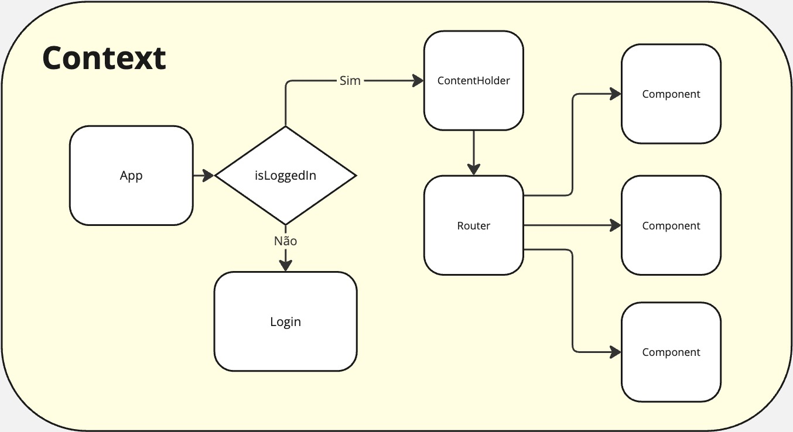

# School Blog Front

Este repositório é parte de um projeto de pós-graduação da FIAP. O **School Blog** é uma plataforma onde professores interagem com alunos por meio de postagens em um blog.

## ⚡ 1. Quick Run

Caso não queira baixar o repositório do backend, você pode rodar o seguinte comando em um terminal separado para iniciar o backend via Docker:

```bash
docker run -p 3000:3000 davidlblanco/school-blog-back:latest
```

Em seguida, instale as dependências e inicie o frontend:

```bash
npm install
npm run dev
```

> **Observação:** Este modo simula o backend de produção portanto salvará no banco de produção

---

## 🔧 2. Dev Run

### Passo a passo:

1. Baixe o repositório do backend:
   [GitHub - school-blog-back](https://github.com/Davidlblanco/school-blog-back)

2. Siga as instruções no README do repositório do backend para executá-lo localmente.

3. Inicie o frontend:

```bash
npm install
npm run dev
```

> **Observação:** Para rodar este repositório em modo de desenvolvimento, é necessário executar o backend localmente.

---

## 🚀 3. Deploy

Ao realizar um commit na branch `master`, o frontend é automaticamente deployado na Vercel.  
Acesse a aplicação em: [https://school-blog-front.vercel.app/](https://school-blog-front.vercel.app/)

---

## 📚 4. Fluxos da Aplicação



-   **Autenticação:**  
    Ao entrar na aplicação, é verificado se existe um cookie chamado `school-blog-jwt`. Este cookie contém o JWT que autoriza as requisições ao backend.

    -   Se o JWT for do tipo `ADMIN`, o usuário terá acesso total.
    -   Usuários com as roles `TEACHER` ou `STUDENT` terão acesso apenas aos componentes específicos de suas permissões.

-   **Segurança:**  
    Mesmo que alguém tente burlar o frontend, todas as requisições ao backend exigem um JWT válido, garantindo que apenas informações autorizadas sejam acessadas.

---

## 🛠️ Estrutura de Componentes

### Componentes Principais

-   **`./App.tsx`**:  
    O componente principal que engloba:

    -   **`./contexts/MainProvider.tsx`**: Contexto global da aplicação, onde são gerenciadas variáveis compartilhadas.
    -   **`./isLoggedIn.tsx`**: Verifica se o usuário está logado. Caso esteja, renderiza `ContentHolder`; caso contrário, exibe a tela de login.

-   **`./components/ContentHolder`**:  
    Componente pai das páginas protegidas, responsável por renderizar os componentes corretos com base nas rotas.

---

### Regras de Acesso

1. **ADMIN**:  
   Permissão total, incluindo gerenciamento de usuários e artigos.

    - **`./components/CreateUpdateUser`**:  
      Cria e atualiza usuários.  
      Rotas: `/admin/UpdateUser/:id` (update) e `/admin/CreateUser` (create).

    - **`./components/ListUsers`**:  
      Lista usuários do sistema.  
      Rota: `/admin/ListUsers`.

2. **ADMIN e TEACHER**:  
   Permissão para gerenciar e visualizar artigos.

    - **`./components/List`**:  
      Lista artigos com opções de editar e remover.  
      Rota: `/`.

    - **`./components/UpdateArticle`**:  
      Formulário para criar ou atualizar artigos.  
      Rotas: `/updateArticle/:id` e `/createArticle`.

3. **STUDENT, ADMIN e TEACHER**:  
   Acesso limitado à visualização de artigos e gerenciamento de conta.

    - **`./components/List`**:  
      Exibe artigos sem opções de edição/remoção.  
      Rota: `/`.

    - **`./components/View`**:  
      Exibe o conteúdo de um artigo.  
      Rota: `/:id`.

    - **`./components/MyAccount`**:  
      Permite que cada usuário atualize seus próprios dados.  
      Rota: `/myAccount`.

---

## 🔧 Ferramentas e Utilitários

O repositório conta com ferramentas customizadas e hooks específicos, organizados na pasta `./utils`.
